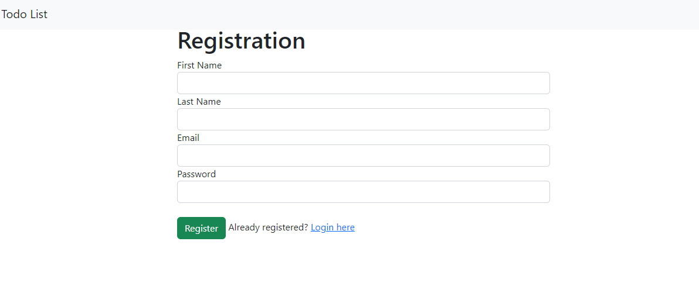
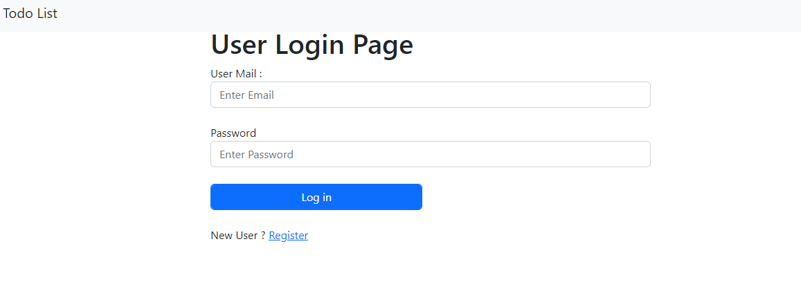
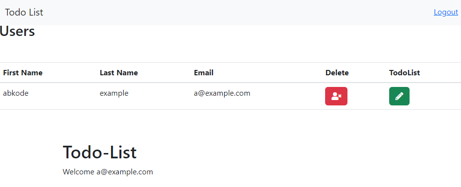
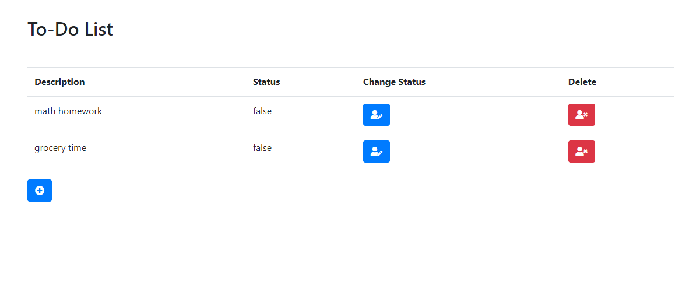
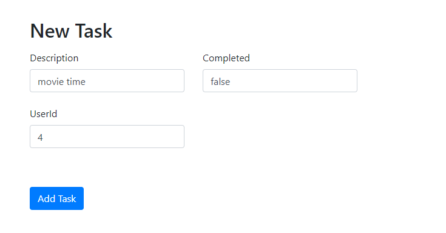
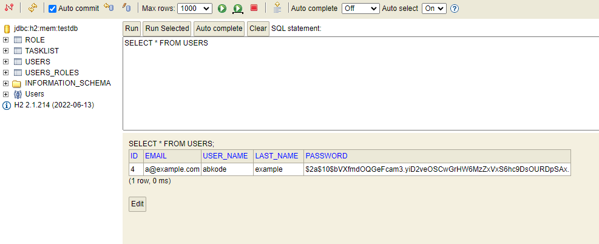
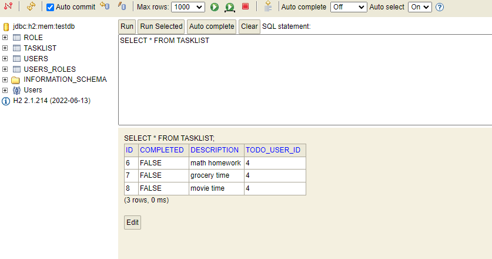
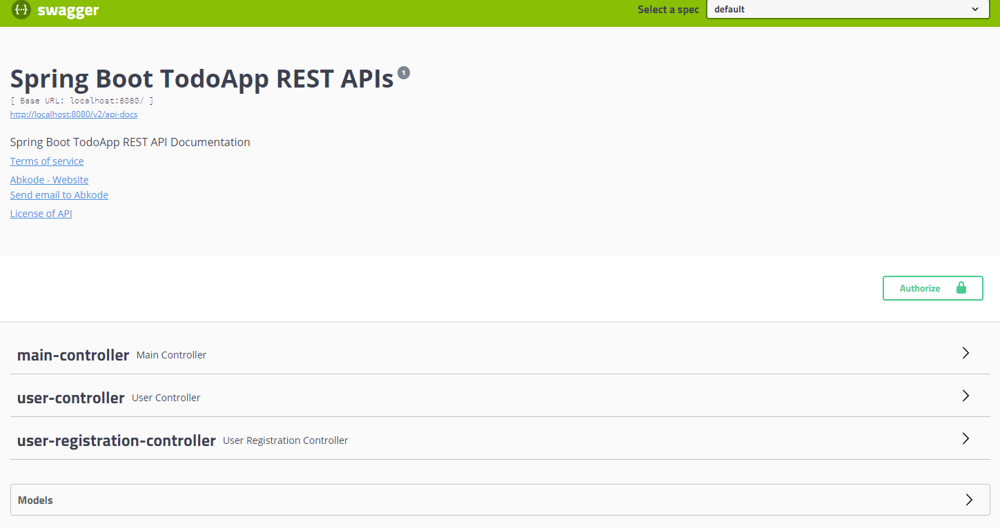
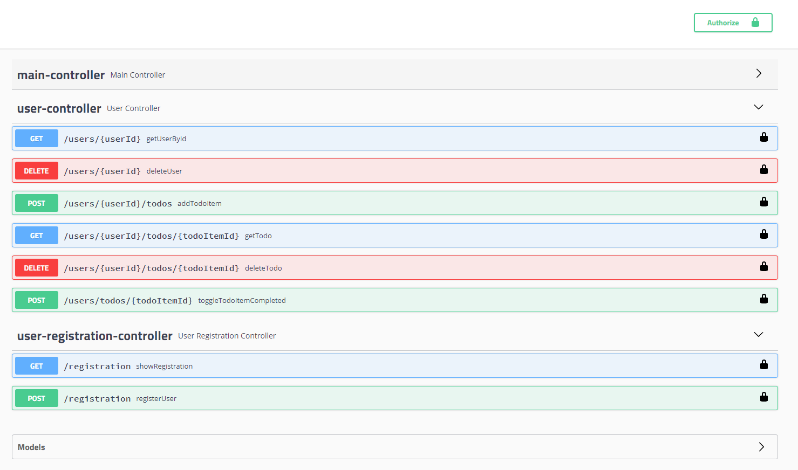

# Todo App Project 
***


***
### Models
- User, TodoItem, Role
***

### Controller
- MainController (for thymeleaf)
- UserController (for swagger) 
- UserRegistrationController (for thymeleaf)

***
### Services
- UserService (Interface) 
- UserServiceImpl 
***

### Repository
- UserRepository (has 1 method)
```
  User findByEmail(String email)
  ```
- TodoItemRepository (has nativeQuery)
```
@Query(nativeQuery = true, value = "SELECT * FROM TASKlIST WHERE TODO_USER_ID= ?1")
    List<TodoItem> findAllByUserId(int id);
```
***

### Register Json for Swagger :
```json
{
  "firstName": "abkode",
  "lastName": "example",
  "password": "123",
  "email": "aa@deneme.com"
}
```
***
### Register for Thymeleaf :

***
### Login with Thymeleaf :

***
### Index Page After Login : 

--Delete button and todolist buttons are active. 
***
***
### ToDo Page After Index : 

---Use change status button to change false to true and also u can delete it.
***
***
### New Task Page After Index :

***
### H2Database User : 

***
### H2Database TaskList : 

***
### Swagger-ui :


***
